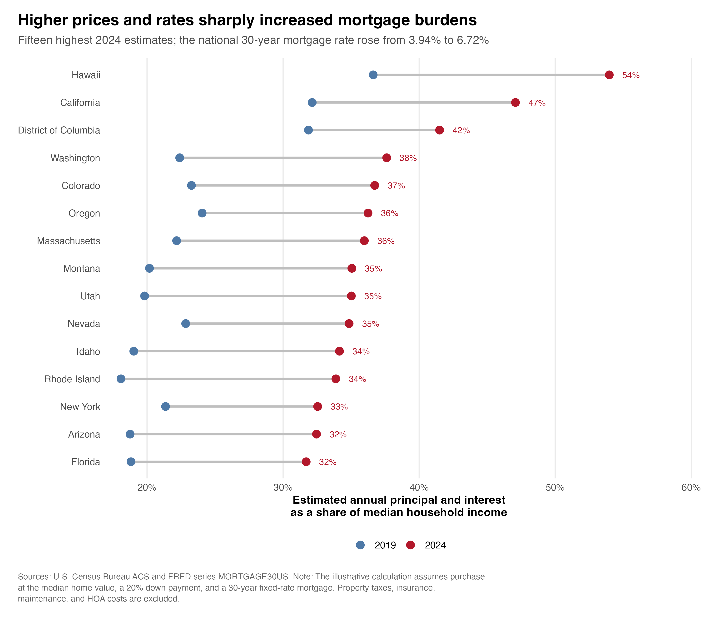

# Priced Out: How Did Housing Affordability Change Across U.S. States from 2019 to 2024?

## Overview

This blog-post examines how housing affordability changed across the 50 U.S. states and Washington, D.C. between 2019 and 2024. I focus on a straightforward question: did household income keep pace with rising home values, and how did higher mortgage rates change the cost of buying a typical home?

Housing affordability cannot be measured by home values alone. A $300,000 home has a different meaning in a state with a median household income of $60,000 than in a state with a median income of $100,000. Financing conditions also matter. Even if a home’s value stays constant, a higher mortgage rate increases the monthly payment required to purchase it. For that reason, this analysis considers home values, household incomes, and mortgage rates together.

## Data

The analysis uses two main data sources.

- **[U.S. Census Bureau, American Community Survey (ACS), 1-year estimates](https://www.census.gov/programs-surveys/acs/data.html)**
  - `B19013_001E`: median household income
  - `B19013_001M`: margin of error for median household income
  - `B25077_001E`: median value of owner-occupied housing units
  - `B25077_001M`: margin of error for median home value
  - State-level observations are downloaded for 2019 and 2024 through the Census API.

- **Freddie Mac, accessed through FRED at the Federal Reserve Bank of St. Louis**
  - [`MORTGAGE30US`](https://fred.stlouisfed.org/series/MORTGAGE30US): 30-Year Fixed Rate Mortgage Average in the United States
  - Weekly observations are downloaded through the FRED API and averaged within each year.

The raw ACS download includes Puerto Rico. I exclude it from the main analysis so that the final dataset consistently covers the 50 states and Washington, D.C. The ACS margins of error are retained in the data files for documentation, although the visualizations use the published point estimates.

The Census and FRED API keys are stored locally in `~/.Renviron`. They are not written in the R scripts or included in this repository.

## Measures and calculations

I use three related measures of housing affordability: the home-value-to-income ratio, the relative growth of home values and income, and an illustrative mortgage-payment burden. All measures are constructed programmatically in `code/02_clean_data.R`.

### Home-value-to-income ratio

For state \(s\) in year \(t\), the home-value-to-income ratio is:

$$
R_{s,t}
=
\frac{V_{s,t}}{Y_{s,t}},
$$

where:

- \(V_{s,t}\) is the median value of owner-occupied housing units;
- \(Y_{s,t}\) is median household income.

A higher value of \(R_{s,t}\) means that a typical owner-occupied home is more expensive relative to annual household income.

The change shown in the first visualization is:

$$
\Delta R_s
=
R_{s,2024}
-
R_{s,2019}.
$$

A positive value of \(\Delta R_s\) indicates that median home values increased relative to median household income.

### Growth in home values and income

For either median home value or median household income, cumulative growth from 2019 to 2024 is calculated as:

$$
g_{X,s}
=
\left(
\frac{X_{s,2024}}{X_{s,2019}}
-
1
\right)
\times 100,
$$

where \(X\) represents the variable being measured.

The difference between home-value growth and income growth is:

$$
G_s
=
g_{V,s}
-
g_{Y,s}.
$$

A positive value of \(G_s\) means that median home values grew faster than median household income. Both ACS variables are reported in each survey year’s dollars, so this comparison focuses on whether income kept pace with the change in home values.

### Annual mortgage rate

The FRED series contains weekly observations. For each year, I calculate the arithmetic average of the available weekly mortgage rates:

$$
\bar{i}_t
=
\frac{1}{N_t}
\sum_{w=1}^{N_t} i_{w,t},
$$

where \(i_{w,t}\) is the mortgage rate in week \(w\) of year \(t\), and \(N_t\) is the number of weekly observations in that year.

The resulting annual averages are 3.94% in 2019 and 6.72% in 2024.

### Illustrative monthly mortgage payment

The mortgage calculation assumes a 20% down payment. The loan principal for state \(s\) in year \(t\) is therefore:

$$
P_{s,t}
=
0.80V_{s,t}.
$$

The monthly interest rate is:

$$
r_t
=
\frac{\bar{i}_t}{12 \times 100},
$$

where the division by 100 converts the annual percentage rate into decimal form.

The total number of payments for a 30-year mortgage is:

$$
n
=
30 \times 12
=
360.
$$

The monthly principal-and-interest payment is calculated using the standard fixed-payment mortgage formula:

$$
M_{s,t}
=
P_{s,t}
\left[
\frac{
r_t(1+r_t)^n
}{
(1+r_t)^n-1
}
\right].
$$

### Illustrative mortgage-payment burden

The estimated annual mortgage-payment burden is:

$$
B_{s,t}
=
\frac{
12M_{s,t}
}{
Y_{s,t}
}
\times 100.
$$

This measure represents estimated annual principal and interest payments as a percentage of median household income.

The same national mortgage rate is applied to every state within each year. This allows the analysis to show how the combination of changing home values, household incomes, and financing conditions affected the estimated payment burden.

The calculation does not include property taxes, homeowners insurance, maintenance, closing costs, or HOA fees. It should therefore be interpreted as a consistent financing-cost comparison rather than a complete measure of homeownership costs.

The ACS home-value measure is based on reported values of existing owner-occupied homes, not the transaction prices faced by a representative homebuyer. Median household income also covers both owner and renter households. The measures in this project should therefore be interpreted as state-level affordability indicators rather than exact budgets for individual buyers.

## Main findings

Housing affordability deteriorated in almost every jurisdiction in the analysis. The home-value-to-income ratio increased in 50 of the 51 jurisdictions—the 50 states plus Washington, D.C. Across these jurisdictions, the median ratio rose from **3.42 in 2019 to 4.24 in 2024**.

The median state-level increase in home values was **49.4%**, compared with a median state-level increase of **24.5%** in household income. Home values grew faster than household income in 50 of the 51 jurisdictions.

Rhode Island experienced the largest increase in its home-value-to-income ratio, which rose from 3.98 to 5.46. The next-largest increases occurred in Idaho, Utah, Montana, and Tennessee.

Higher mortgage rates added another layer of pressure. The annual average 30-year fixed mortgage rate increased from **3.94% in 2019 to 6.72% in 2024**. Under the assumptions used in this project, the median estimated mortgage burden across the 51 jurisdictions increased from **15.6% of median household income in 2019 to 26.3% in 2024**. The median of the state-level increases was approximately **9.64 percentage points**.

The highest estimated mortgage burdens in 2024 were in Hawaii, California, Washington, D.C., Washington, and Colorado. Hawaii’s estimate reached approximately **54.0% of median household income**, compared with 36.6% under the 2019 home value, income, and interest rate.

Together, the results suggest that the affordability shift was not only the result of higher home values. Incomes generally failed to keep pace, while higher mortgage rates made financing a typical home substantially more expensive.

## Visualizations

### 1. Change in the home-value-to-income ratio

This map shows how much each state’s home-value-to-income ratio changed between 2019 and 2024. Positive values indicate that median home values increased relative to median household income.


### 2. Home-value growth compared with income growth

The dashed line represents equal growth in home values and household income. States above the line experienced faster growth in home values than in income.


### 3. Estimated mortgage-payment burden

This figure compares the estimated mortgage burden in 2019 and 2024 for the 15 jurisdictions with the highest 2024 estimates.



## Repository structure

```text
blogpost4_dataset_of_choice/
├── .gitignore
├── README.md
├── blogpost4_dataset_of_choice.Rproj
├── code/
│   ├── 01_download_data.R
│   ├── 02_clean_data.R
│   └── 03_create_visualizations.R
├── data/
│   ├── raw/
│   │   ├── acs_state_housing_income_2019_2024.csv
│   │   ├── data_sources.csv
│   │   └── fred_mortgage_rate_2019_2024.csv
│   └── processed/
│       ├── national_mortgage_rates_annual.csv
│       └── state_housing_affordability_2019_2024.csv
└── output/
    └── figures/
        ├── figure_1_affordability_change_map.png
        ├── figure_2_home_value_vs_income_growth.png
        └── figure_3_mortgage_burden_comparison.png
```

- `01_download_data.R` downloads the ACS and FRED data and saves the raw files.
- `02_clean_data.R` cleans and combines the data and constructs the affordability measures.
- `03_create_visualizations.R` produces and saves the three final figures.
- `data/raw/` contains the programmatically downloaded source data.
- `data/processed/` contains the state-level analysis dataset and annual mortgage rates.
- `output/figures/` contains the final visualizations.

## Reproducing the analysis

Open `blogpost4_dataset_of_choice.Rproj` in RStudio.

Install the required packages if they are not already installed:

```r
install.packages(
  c(
    "dplyr",
    "purrr",
    "readr",
    "tidyr",
    "tibble",
    "jsonlite",
    "fredr",
    "ggplot2",
    "scales",
    "ggrepel",
    "stringr",
    "usmap"
  )
)
```

Obtain personal API keys from:

- [U.S. Census Bureau](https://www.census.gov/data/developers.html)
- [FRED](https://fred.stlouisfed.org/docs/api/api_key.html)

Store the keys in `~/.Renviron`:

```text
FRED_API_KEY=your_fred_key
CENSUS_API_KEY=your_census_key
```

Do not include quotation marks around the keys. After saving `.Renviron`, restart RStudio so that the environment variables are available.

The keys can be checked without displaying their values:

```r
Sys.getenv("FRED_API_KEY") != ""
Sys.getenv("CENSUS_API_KEY") != ""
```

Both commands should return `TRUE`.

Run the scripts in order:

```r
source("code/01_download_data.R")
source("code/02_clean_data.R")
source("code/03_create_visualizations.R")
```

The scripts will recreate the raw data, processed data, and all three visualization files. No manual copying or editing of the downloaded data is required.